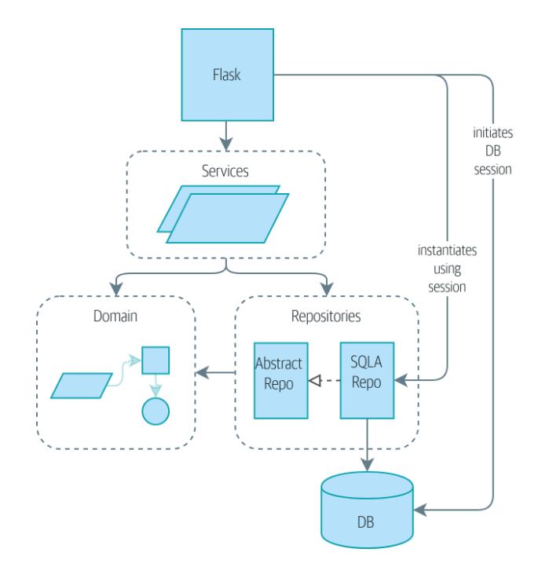
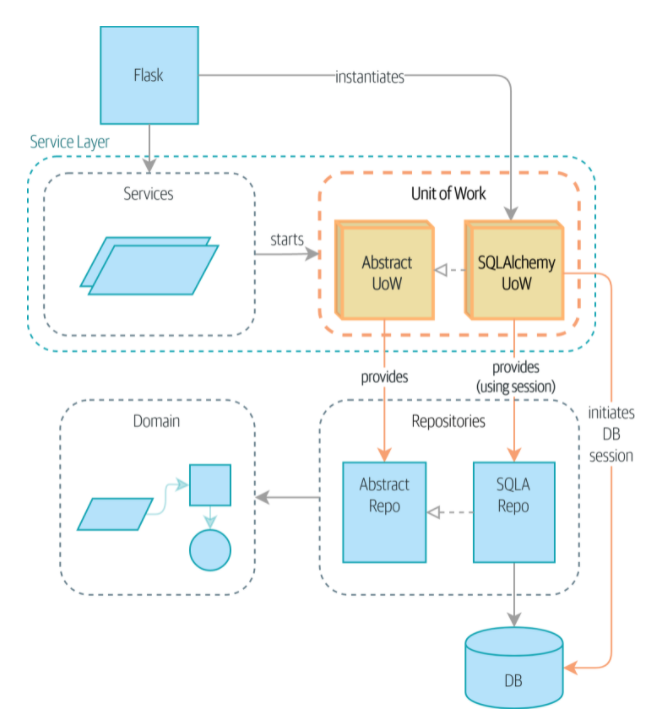

# Chapter6. 작업 단위 패턴

> 작업 단위 패턴? 저장소와 서비스 계층 패턴을 하나로 묶어 주는 패턴

> 저장소패턴 - 영속적 저장소 개념에 대한 추상화

> 작업 단위 패턴 - 원자적 연산(atomic operation)의 추상화


- UoW가 없는 경우: API는 세 가지 계층과 직접 대화 가능




- UoW가 있는 경우: 이제 UoW가 데이터베이스 상태 관리
  - 플라스크의 일: 작업 단위 초기화, 서비스를 호출
  - 서비스는 UoW와 협력하지만 서비스 함수 자체나 플라스크는 이제 데이터베이스와 직접 대화하지 않는다.




## 6.1 작업 단위는 저장소와 협력

- 작업 단위가 작동하는 모습 예시
```python
def allocate(orderid: str, sku: str, qty: int, uow: unit_of_work.AbstractUnitOfWork) -> str:
    line = OrderLine(orderid, sku, qty)

    with uow:  # 콘텍스트 관리자로 UoW를 시작한다.  => 영속적 저장소에 대한 단일 진입점 -> 어떤 객체가 메모리에 적재됐고 어떤 객체가 최종 상태인지를 기억한다.
        batches = uow.batches.list()  # uow.batches는 배치 저장소다. 따라서 UoW는 영속적 저장소에 대한 접근을 제공한다.
        ...
        uow.commit()  # 작업이 끝나면 UoW를 사용해 커밋하거나 롤백한다.
```

- 작업 단위 사용의 장점
    - *작업에 사용할 데이터베이스의 안정적 스냅샷을 제공, 연산을 진행하는 과정에서 변경하지 않은 객체에 대한 스냅샷도 제공*
    - 변경 내용을 한번에 영속화할 방법 제공, 어딘가 잘못되더라도 일관성이 없는 상태로 끝나지 않는다.
    - 영속성을 처리하기 위한 간단한 API와 저장소를 쉽게 얻을 수 있는 장소를 제공한다.
    

## 6.2 테스트-통합 테스트로 UoW 조정하기

```python 
def test_uow_can_retrieve_a_batch_and_allocate_to_it(session_factory):
    session = session_factory()
    insert_batch(session, 'batch1', 'HIPSTER-WORKBENCH', 100, None)
    session.commit()

    uow = unit_of_work.SqlAlchemyUnitOfWork(session_factory)  # 커스텀 세션 팩토리를 사용해 UoW를 초기화하고 블록 안에서 사용할 uow 객체를 얻는다.
    with uow:
        batch = uow.batches.get(reference='batch1')  # uow는 uow.batches를 통해 배치 저장소에 대한 접근을 제공
        line = model.OrderLine('o1', 'HIPSTER-WORKBENCH')
        uow.commit()  # 작업 후 commit

    batchref = get_allocated_batch_ref(session, 'o1', 'HIPSTER-WORKBENCH')
    assert batchref == 'batch1'

```

## 6.3 작업 단위와 작업 단위의 콘텍스트 관리자

**추상 기반 클래스 인터페이스**
```python
class AbstractUnitOfWork(abc.ABC):
    batches: repository.AbstractRepository
    
    def __exit__(self, *args):
        self.rollback()
        
    @abc.abstractmethod
    def rollback(self):
        raise NotImplementedError
    
    @abc.abstractmethod
    def commit(self):
        raise NotImplementedError
```

###  6.3.1 SQLAlchemy 세션을 사용하는 실제 작업 단위
```python
DEFAULT_SESSION_FACTORY = sessionmaker(bine=create_engine(
    config.get_postgres_uri()
))


class SqlAlchemyUnitOfWork(AbstractUnitOfWork):
    def __init__(self, session_factory=DEFAULT_SESSION_FACTORY):
        self.session_factory = session_factory
        
    def __enter__(self):  # 데이터베이스 세션 시작하고 이 데이터베이스 세션을 사용할 실제 저장소를 인스턴스화한다.
        self.session = self.session_factory()
        
    def __exit__(self, *args):
        super().__exit__(*args)
        self.session.close()
        
    def commit(self):
        self.session.commit()
        
    def rollback(self):
        self.session.rollback()
```

### 6.3.2 테스트를 위한 가짜 작업 단위(서비스 계층 테스트에서 가짜 UoW를 사용하는 방법)
FakeUnitOfWork는 FakeSession에서 진행하던 commited 기능과 저장소의 기능을 아우른다.
```python
class FakeUnitOfWork(unit_of_work.AbstractUnitOfWork):
    def __init__(self):
      # FakeUnitWork와 FakeRepository는 실제 UnitofWork와 Repository 클래스가 결합되어 있는 것처럼 밀접하게 결합되어 있다. 이 객체들은 협렵자라고 인식하므로 문제가 되지 않는다.
        self.batches = FakeRepository([])
        self.committed = False
        
    def commit(self):
        self.committed = True

    def rollback(self):
        pass

def test_add_batch():
    # 테스트에서는 UoW를 인스턴스화하고, 서비스 계층에 저장소와 세션을 넘기는 대신 인스턴스화한 UOW를 넘길 수 있다. 이런 구조는(저장소와 세션을 넘기는 것보다)훨씬 덜 번거롭다.
    uow = FakeUnitOfWork()
    services.add_batch("b1", "CRUNCHY-ARMCHAIR", 100, None, uow)
    assert uow.batches.get("b1") is not None
    assert uow.committed


def test_allocate_returns_allocation():
    uow = FakeUnitOfWork()
    services.add_batch("batch1", "COMPLICATED-LAMP", 100, None, uow)
    result = services.allocate("o1", "COMPLICATED-LAMP", 10, uow)
    assert result == "batch1"
```

> *세션보다 UoW를 모킹하는 것이 더 편한 이유는 무엇인가?*

- 실제 데이터베이스를 사용하지 않고도 메모리상에서 테스트를 진행할 수 있게 해준다.
- 실행이 빠른 테스트를 만들고 싶다면? SQLAlchemy 대신 mock을 만들고, 코드베이스 전체에 적용한다. 


## 6.4 UoW를 서비스 계층에 사용하기
- service 계층에서의 의존성은 UoW 추상화 하나뿐이다. (이전까지는 repository와 session에 대한 의존성이 존재했다.)

```python
def add_batch(
        ref: str, sku: str, qty: int, eta: Optional[date],
        uow: unit_of_work.AbstractUnitOfWork,
    ):
    with uow:
        uow.batches.add(model.Batch(ref, sku, qty, eta))
        uow.commit()


def allocate(orderid: str, sku: str, qty: int, uow: unit_of_work.AbstractUnitOfWork) -> str:
    line = OrderLine(orderid, sku, qty)

    with uow:  # 콘텍스트 관리자로 UoW를 시작한다.  => 영속적 저장소에 대한 단일 진입점 -> 어떤 객체가 메모리에 적재됐고 어떤 객체가 최종 상태인지를 기억한다.
        batches = uow.batches.list()  # uow.batches는 배치 저장소다. 따라서 UoW는 영속적 저장소에 대한 접근을 제공한다.
        
        if not is_valid_sku(line.sku, batches):
            raise InvalidSku('Invalid sku {line.sku}')
        
        batchref = model.allocate(line, batches)
        uow.commit()  # 작업이 끝나면 UoW를 사용해 커밋하거나 롤백한다.
    
    return batchref
```

## 커밋/롤백 동작에 대한 명시적인 테스트
```python
def test_rolls_back_uncommitted_work_by_default(session_factory):
    uow = unit_of_work.SqlAlchemyUnitOfWork(session_factory)
    with uow:
        insert_batch(uow.session, "batch1", "MEDIUM-PLINTH", 100, None)

    new_session = session_factory()
    rows = list(new_session.execute('SELECT * FROM "batches"'))
    assert rows == []


def test_rolls_back_on_error(session_factory):
    class MyException(Exception):
        pass

    uow = unit_of_work.SqlAlchemyUnitOfWork(session_factory)
    with pytest.raises(MyException):
        with uow:
            insert_batch(uow.session, "batch1", "LARGE-FORK", 100, None)
            raise MyException()

    new_session = session_factory()
    rows = list(new_session.execute('SELECT * FROM "batches"'))
    assert rows == []
```

## 6.6 명시적 커밋과 암시적 커밋
- UoW 패턴: 디폴트로 결과를 커밋하고 예외가 발생한 경우에만 롤백 수행

```python
def __enter__(self):
    return self

def __exit__(self, exn_type, exm_value, traceback):
    if exn_type:
        self.commit()
    else:
        self.rollback()
```

- UoW를 사용하면 클라이언트 코드에서 명시적인 커밋을 생략해 코드 한 줄을 줄일 수 있다.(기존 코드에서 commit 부분 제거)


## 6.7 UoW를 사용해 여러 연산을 원자적 단위로 묶기
- 아래 예제를 통해 UoW 사용하면 코드 블록에서 벌어지는 일에 대한 추론이 간단해 짐을 알 수 있다.
```python
def reallocate(line: OrderLine, uow: unit_of_work.AbtractUnitOfWork) -> str:
    with uow:
        batch = uow.batches.get(sku=line.sku)
        if batch is None:
            raise InvalidSku('Invalid sku {line.sku}')

        # 실제로 Uow에 예외 커밋 조건을 설정하여 실패했을 경우 커밋이 진행되지 않는다.
        batch.deallocate(line)  # deallocate() 가 실패하면 당연히 allocate()를 호출하는 걸 원치 않는다.
        allocate(line)  # 실제로 allocate()가 실패한다면 deallocate()한 결과만 커밋하고 싶지는 않을것이다.
        uow.commit()


def change_batch_quantity(batchref: str, new_qty: int, uow: AbstractUnitOfWork):
    with uow:
        batch = uow.batches.get(reference=batchref)
        batch.change_purchased_quantity(new_qty)
        while batch.available_quantity < 0:
            line = batch.deallocate_one()
        uow.commit() 
```

## 작업 단위 패턴 정리
- 작업 단위 패턴은 데이터 무결성 중심 추상화다.
  - 작업 단위 패턴을 사용하면 연산의 끝에 플러시 연산을 한 번만 수행해 도메인 모델의 일관성을 강화하고 성능을 향상시킬 때 도움이 된다.


- 작업 단위 패턴은 저장소와 서비스 꼐층 패턴과 밀접하게 연관되어 작동한다.
  - 작업 단위 패턴은 원자적 업데이트를 표현해 데이터 접근에 대한 추상화를 완성시켜준다. 서비스 계층의 유스 케이스들은 각각 블록단위로 성공하거나 실패하는 별도의 작업 단위로 실행된다.
  

- 콘텍스트 관리자를 사용하는 멋진 유스 케이스다.
  - 콘텍스트 관리자는 파이썬에서 영역을 정의하는 전형적인 방법이다. 콘텍스트 관리자를 사용해 요청 처리가 커밋을 호출하지 않고 끝나면 자동으로 작업을 롤백할 수 있다. 이런 식으로 구현하면 시스템은 기본적으로 항상 안전한 상태가 된다.
  

- SQLAlchemy는 이미 작업 단위 패턴을 제공한다.
  - SQLAlchemy Session 객체를 더 간단하게 추상화해서 ORM과 코드 사이의 인터페이스를 더 좁힌다. 이렇게 하면 코드의 각 부분의 결합을 느슨하게 유지할 수 있다.
